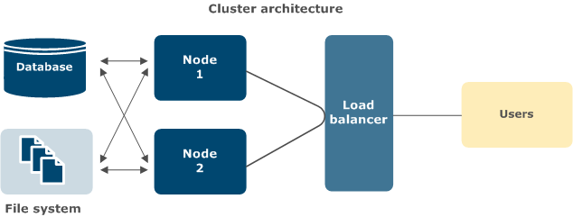

# Cluster architecture

A typical architecture of a cluster environment for <madcap:variable name="axway_variables.Component Short Name"></madcap:variable> can consist of:

*   Two or more application server nodes running <madcap:variable name="axway_variables.Component Short Name"></madcap:variable>
*   One shared database used by all nodes
*   A shared file system (for example, <madcap:glossaryterm glossterm="clusters.Term2">NAS</madcap:glossaryterm> running the <madcap:glossaryterm glossterm="app_studio_install.Term0">NFS</madcap:glossaryterm> protocol). You can have more than one. For example, one to share the `wflow` directory and another to share the `appstudio-keystore` and `appstudio-truststore` files.
*   A load balancer to distribute processing among the application server nodes

In this architecture, if one application server node goes down, users can access <madcap:variable name="axway_variables.Component Short Name"></madcap:variable> through other nodes. However, this does not protect from failures in a shared database or shared file system. To further improve availability, you can use a database cluster and <madcap:glossaryterm glossterm="app_studio_install.Term2">RAID</madcap:glossaryterm> in the shared file system.

<madcap:relationshipsproxy></madcap:relationshipsproxy>

